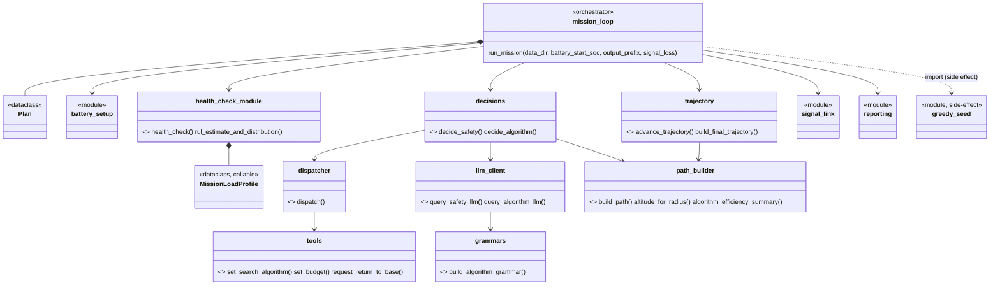

# SAR Drone LLM Agent

Agente per missioni di ricerca e soccorso (Search and Rescue) con drone, pensato per girare su target embedded (ZCU102, ARM Cortex-A53, validato prima su QEMU aarch64). Combina:

- **SAREnv (dipendenza esterna)** - generazione dei percorsi di ricerca (spiral, concentric circles, pizza zigzag, greedy) e valutazione (copertura, rilevamento dispersi) su dataset geospaziali reali.
- **[ProgPy](https://github.com/nasa/progpy)** - prognostica della batteria (Remaining Useful Life) tramite modello elettrico (`BatteryCircuit`) e stima Monte Carlo.
- **Qwen2.5-Coder-0.5B**, servito localmente via `llama.cpp`/`llama-server` con decoding vincolato a grammatica (GBNF) - l'LLM non genera mai testo libero, solo classificazioni/tool call strutturati.

Le soglie di sicurezza (rientro alla base obbligatorio) sono **logica Python deterministica**, mai delegate al modello. L'LLM interviene solo su decisioni non safety-critical (postura di rischio entro il margine sicuro, scelta dell'algoritmo di ricerca).

## Architettura



Un file per responsabilità, nessuno oltre le ~90 righe (eccetto `llm_client.py`, coeso: solo prompt/grammatica LLM). Struttura:

```
agent/
  planning_bridge/   Plan (stato missione), path_builder (SAREnv <-> agente)
  battery_health/     health_check (guardrail deterministico + RUL)
  llm_agent/
    mission_loop.py   orchestratore (~150 righe)
    battery_setup.py  batteria ProgPy
    greedy_seed.py     determinismo del path greedy
    trajectory.py       traiettoria persistente tick-per-tick
    decisions.py         decide_safety / decide_algorithm
    dispatcher.py, tools.py   function calling
    grammars.py, gbnf/         grammatiche GBNF (statiche + dinamiche)
    llm_client.py         prompt e chiamate a llama-server
    signal_link.py         simulazione narrativa perdita segnale
    reporting.py            export PDF (traiettoria, mappa dispersi)
```

## Setup

### 1. Dipendenze esterne (non incluse nel repo)

Clona **SAREnv** come cartella sibling di questo repo (sostituisci `<url-sarenv>` con l'URL del tuo fork/repo):
```bash
cd ..
git clone <url-sarenv> SAREnv
```

Costruisci **llama.cpp** separatamente e scarica un GGUF di Qwen2.5-Coder-0.5B-Instruct (vedi [documentazione llama.cpp](https://github.com/ggml-org/llama.cpp)).

### 2. Ambiente Python

```bash
python3 -m venv .venv
source .venv/bin/activate
pip install -r requirements.txt
pip install -e ../SAREnv
pip install -r ../SAREnv/requirements.txt  # il pyproject.toml di SAREnv non dichiara tutte le sue dipendenze runtime (es. colorama)
```

### 3. Variabili d'ambiente

- `SARENV_DATASET_DIR`: percorso a un ambiente del dataset SAREnv (default: `../SAREnv/sarenv_dataset/19`, assume il sibling-clone del passo 1).

### 4. Avvia il server LLM

```bash
llama-server -m /path/al/modello-q4_k_m.gguf --port 8080
```
(`llm_client.py` si aspetta `http://127.0.0.1:8080`.)

## Esecuzione

```bash
python -m agent.llm_agent.mission_loop
```

Oppure, per parametrizzare una missione:
```python
from agent.llm_agent.mission_loop import run_mission

run_mission(battery_start_soc=0.75, output_prefix="mission", signal_loss=True)
```

- `battery_start_soc`: carica iniziale (0-1, default 1.0).
- `signal_loss`: se `True`, il piano resta congelato (nessuna chiamata LLM) finché il segnale radio simulato è connesso - il guardrail di sicurezza resta comunque sempre attivo. Default `False` (segnale puramente narrativo, nessun effetto).

Genera due PDF (`{output_prefix}_trajectory.pdf`, `{output_prefix}_victims_map.pdf`) con la mappa di probabilità, la traiettoria percorsa e i dispersi trovati.

## Limitazioni dichiarate

- QEMU (validazione funzionale del port aarch64) non fornisce numeri di latenza cycle-accurate - solo indicativi.
- Il modello di potenza per algoritmo/quota è una semplificazione (correnti plausibili, non misurate su hardware reale); l'altitudine non penalizza la risoluzione di rilevamento nel modello, a differenza della realtà.
- `signal_loss` è un meccanismo di test/dimostrazione, non un vero sistema di failover comunicazione-terra.
