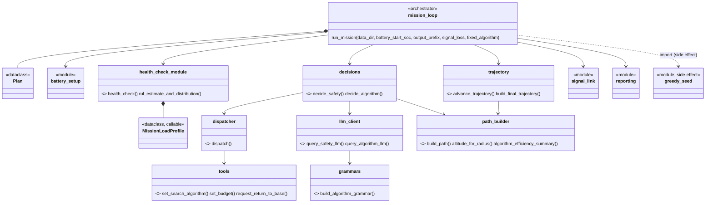
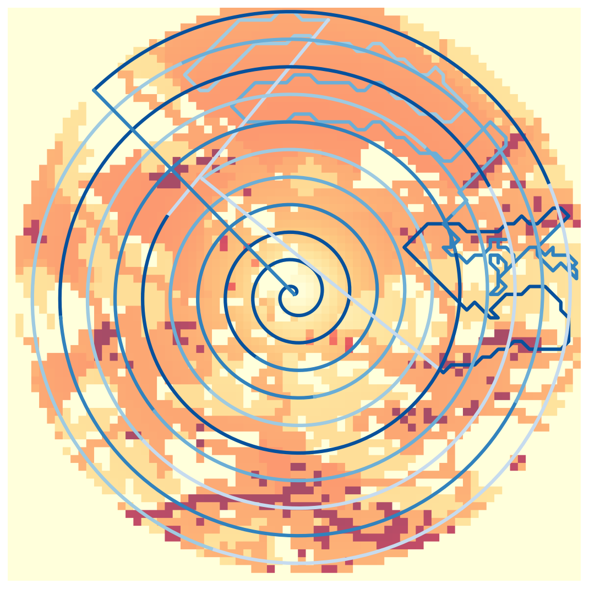
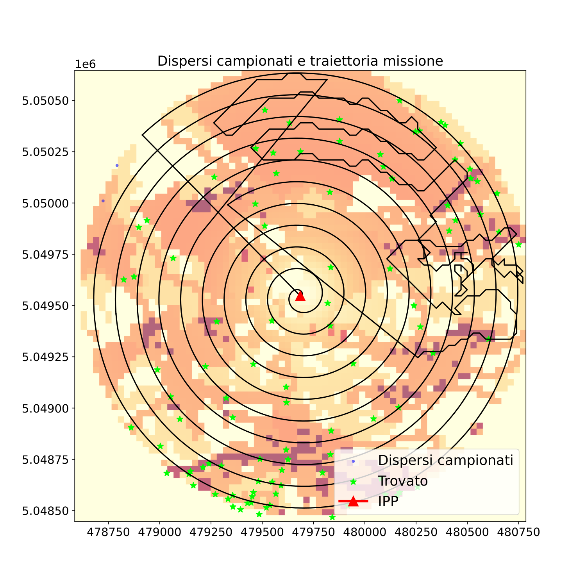

# SAR Drone LLM Agent

Agente per missioni di ricerca e soccorso (Search and Rescue) con drone, pensato per girare su target embedded reale (**Jetson Orin**, CPU Cortex-A78AE + GPU Ampere; validato prima su QEMU aarch64, emulazione TCG non cycle-accurate). Combina:

- **SAREnv (dipendenza esterna)** - generazione dei percorsi di ricerca (spiral, concentric circles, pizza zigzag, greedy) e valutazione (copertura, rilevamento dispersi) su dataset geospaziali reali.
- **[ProgPy](https://github.com/nasa/progpy)** - prognostica della batteria (Remaining Useful Life) tramite modello elettrico (`BatteryCircuit`) e stima Monte Carlo.
- **Qwen2.5-Coder-0.5B**, servito localmente via `llama.cpp`/`llama-server` con decoding vincolato a grammatica (GBNF) - l'LLM non genera mai testo libero, solo classificazioni/tool call strutturati.

Le soglie di sicurezza (rientro alla base obbligatorio) sono **logica Python deterministica**, mai delegate al modello. L'LLM interviene solo su decisioni non safety-critical (postura di rischio entro il margine sicuro, scelta dell'algoritmo di ricerca).

## Architettura



Un file per responsabilità, nessuno oltre le ~90 righe (eccetto `llm_client.py`, coeso: solo prompt/grammatica LLM). Struttura:

```
agent/
  planning_bridge/   Plan (stato missione), path_builder (SAREnv <-> agente)
  battery_health/     health_check (guardrail deterministico + RUL)
  llm_agent/
    mission_loop.py   orchestratore (~150 righe). while-loop principale: tick da
                       TICK_SECONDS=300s, guardrail sempre valutato per primo,
                       poi (se non RETURN_TO_BASE e fixed_algorithm non impostato)
                       decide_safety -> eventualmente decide_algorithm. Stop del
                       loop: guardrail RTB, MAX_MISSION_SECONDS=20000 (tetto duro),
                       o copertura/probabilità osservate oltre
                       SEARCH_COMPLETE_COVERAGE/LIKELIHOOD (evita di continuare a
                       rivalutare la stessa situazione a missione di fatto conclusa).
    battery_setup.py  batteria ProgPy
    greedy_seed.py     determinismo del path greedy
    trajectory.py       traiettoria persistente tick-per-tick
    decisions.py         decide_safety / decide_algorithm - quest'ultima ritorna
                          (coverage_fraction, likelihood_fraction), usati dal
                          chiamante per lo stop anticipato di cui sopra
    dispatcher.py, tools.py   function calling
    grammars.py, gbnf/         grammatiche GBNF (statiche + dinamiche)
    llm_client.py         prompt e chiamate a llama-server (timeout_s=400: le
                           chiamate su target lenti/emulati possono richiedere
                           diversi minuti, verificato empiricamente su QEMU)
    signal_link.py         simulazione narrativa perdita segnale
    reporting.py            export PDF (traiettoria, mappa dispersi)
```

## Setup

### 1. Dipendenze esterne (non incluse nel repo)

Clona **SAREnv** come cartella sibling di questo repo (sostituisci `<url-sarenv>` con l'URL del tuo fork/repo):
```bash
cd ..
git clone <url-sarenv> SAREnv
```

Costruisci **llama.cpp** separatamente e scarica un GGUF di Qwen2.5-Coder-0.5B-Instruct (vedi [documentazione llama.cpp](https://github.com/ggml-org/llama.cpp)). Su Jetson Orin, build con `-DGGML_CUDA=ON -DCMAKE_CUDA_ARCHITECTURES=87` per usare la GPU (Ampere, compute capability 8.7) invece di CPU-only.

### 2. Ambiente Python

```bash
python3 -m venv .venv
source .venv/bin/activate
pip install -r requirements.txt
pip install -e ../SAREnv
pip install -r ../SAREnv/requirements.txt  # il pyproject.toml di SAREnv non dichiara tutte le sue dipendenze runtime (es. colorama)
```

### 3. Variabili d'ambiente

- `SARENV_DATASET_DIR`: percorso a un ambiente del dataset SAREnv (default: `../SAREnv/sarenv_dataset/19`, assume il sibling-clone del passo 1).

### 4. Avvia il server LLM

```bash
llama-server -m /path/al/modello-q4_k_m.gguf --port 8080
```
(`llm_client.py` si aspetta `http://127.0.0.1:8080`.)

## Esecuzione

```bash
python -m agent.llm_agent.mission_loop
```

Oppure, per parametrizzare una missione:
```python
from agent.llm_agent.mission_loop import run_mission

run_mission(battery_start_soc=0.75, output_prefix="mission", signal_loss=True)
```

- `battery_start_soc`: carica iniziale (0-1, default 1.0).
- `signal_loss`: se `True`, il piano resta congelato (nessuna chiamata LLM) finché il segnale radio simulato è connesso - il guardrail di sicurezza resta comunque sempre attivo. Default `False` (segnale puramente narrativo, nessun effetto).
- `fixed_algorithm`: se impostato (es. `"spiral"`), disabilita del tutto le chiamate LLM - vola con questo algoritmo fisso per l'intera missione, solo guardrail attivo. Baseline non adattiva per il confronto contro l'agente LLM-driven (vedi `run_baseline_fixed_algorithm.py`).

Genera due PDF (`{output_prefix}_trajectory.pdf`, `{output_prefix}_victims_map.pdf`) con la mappa di probabilità, la traiettoria percorsa e i dispersi trovati.

## Cosa misuriamo e perché

Oltre al comportamento applicativo (trova i dispersi?), il progetto valida l'agente come sistema **real-time**: rispetta i suoi vincoli temporali, e lo fa in modo isolato/prevedibile anche quando qualcosa va storto (LLM lento, carico concorrente, hardware sotto stress)? Le due categorie di metriche restano volutamente separate, perché confonderle indebolirebbe entrambi gli argomenti.

**Temporizzazione del tick (WCET/BCET, jitter)** - quanto impiega ogni tick, nel caso migliore e nel caso peggiore osservati, e quanto varia tick su tick. Un sistema che decide "in tempo" solo in media non è utilizzabile su un drone reale con vincoli di sicurezza.

**Scomposizione della latenza LLM** - dentro una singola chiamata, quanto tempo va nell'elaborazione del prompt (proxy del time-to-first-token) e quanto nella generazione - due colli di bottiglia fisicamente diversi, con implicazioni diverse per l'ottimizzazione.

**Overhead nativo vs emulato (QEMU/TCG)** - quantificare quanto dei tempi misurati in validazione è artefatto dell'ambiente di test e non comportamento del sistema reale, prima di trarre conclusioni sul target vero.

**Isolamento mixed-criticality (guardrail vs LLM)** - il guardrail deterministico (rientro alla base) non deve mai dipendere da quanto è lenta la decisione "intelligente" in corso. Verificarlo con dati, non solo per costruzione del codice.

**Risorse (memoria, e su hardware reale energia)** - un profilo di memoria che cresce senza limite è un problema per una missione lunga su hardware embedded con RAM fissa; l'energia per decisione è un costo pratico diretto quando l'alimentazione è una batteria.

**Isolamento CPU fisico (`taskset`/`isolcpus`)** - il jitter misurato durante la validazione include rumore introdotto dall'ambiente (scheduler condiviso, altri processi sullo stesso core)? Su hardware senza hypervisor di mezzo, pinnare i processi su core dedicati e confrontare isolato/non isolato separa questo effetto dal comportamento intrinseco del sistema.

**Resilienza sotto carico concorrente** - il sistema è stato misurato in condizioni pulite; interessa anche come si comporta quando la CPU è contesa da altri processi, condizione più realistica di un deployment reale.

**Confronto agente adattivo vs baseline non adattiva** - la selezione dell'algoritmo di ricerca via LLM ha un vantaggio misurabile (dispersi trovati, copertura) rispetto a un pattern di ricerca fisso e non intelligente, a parità di ambiente/batteria? Senza questo confronto, la componente "intelligente" del sistema resta solo un'assunzione.

## Rappresentazioni grafiche prodotte

A fine missione (`reporting.py`) vengono salvati due PDF, entrambi disegnati sopra la stessa mappa di probabilità di SAREnv (`item.heatmap`) - una griglia di celle colorate da crema (probabilità quasi nulla che il disperso sia lì) ad arancione poi a bordeaux/viola scuro (probabilità alta, dedotta da SAREnv da caratteristiche del terreno come boschi, strade, corsi d'acqua).

**`{output_prefix}_trajectory.pdf`** - solo la traiettoria percorsa sopra la mappa di probabilità:



Le linee blu (più scure = tick più recenti) sono il percorso realmente volato, ricostruito tick per tick da `advance_trajectory`. La spirale nasce dal punto IPP (Initial Planning Point, l'ultimo punto noto del disperso) e si allarga verso l'esterno; il segmento più angolare in alto a destra è un tratto di missione dove l'algoritmo attivo era diverso (qui: fase con `greedy`, che insegue le celle a probabilità più alta invece di seguire un pattern geometrico fisso). La linea diagonale sottile è il transito iniziale dal centro verso il primo punto della spirale.

**`{output_prefix}_victims_map.pdf`** - la stessa mappa, con i dispersi campionati sovrapposti:



- **Triangolo rosso (IPP)**: punto di partenza della ricerca
- **Stelle verdi (Trovato)**: dispersi effettivamente rilevati dal drone durante la missione (dentro il raggio di detection lungo la traiettoria)
- **Punti blu (Dispersi campionati)**: posizioni generate da SAREnv per i dispersi non trovati - pochissimi visibili in questo esempio, coerente con il 98% di dispersi trovati in questa run

La numerazione degli assi (`478750`...`480750`, `5.04850e6`...) sono coordinate proiettate (metri), non lat/lon - scala reale della ROI (qui un cerchio di poco più di 2km di diametro).

## Script di supporto per run strumentate (fuori da questo repo)

Vivono in `sara-project/` (la cartella che contiene questo repo come sottocartella `refactor/`), non versionati qui - servono per raccogliere metriche a runtime, non fanno parte della logica dell'agente:

| Script | Cosa fa |
|---|---|
| `run_instrumented_mission.sh` | Orchestratore di una singola run: (ri)avvia `llama-server` con `--metrics`, scraping periodico di `/metrics`, campionamento RSS (`llama-server` + processo Python), `tegrastats` se disponibile (solo hardware Jetson reale), lancia `mission_loop` via journald (`systemd-cat`), a fine run estrae il log ed esegue `parse_mission_log.py`. Variabile opzionale `TASKSET_CORES` (es. `2,3`) per pinning CPU reale (ha senso solo su hardware senza hypervisor di mezzo, es. Orin - non su WSL2/Hyper-V). |
| `parse_mission_log.py` | Converte il log della missione (journald JSON o testo) in `tick_metrics.csv` (un rigo per tick: `t`, `tick_type`, `guardrail_s`, `llm_block_s`, `tick_total_s`, ...). Tiene solo l'ultimo avvio di missione se il journal ne contiene più d'uno (`keep_last_mission`). |
| `run_battery_experiment.py` | Sweep 4 livelli ambiente x 3 batterie x 3 ripetizioni (36 run), salva PDF per run e un riepilogo strutturato in `experiment_results/mission_summary.csv`. |
| `run_baseline_fixed_algorithm.py` | Lancia una singola missione con `fixed_algorithm` impostato (default `spiral`, override via `BASELINE_ALGORITHM`) - il confronto non adattivo richiesto per la relazione. |
| `run_both.sh` | Sequenza baseline (no stress) + run con `stress-ng --cpu 2` attivo, per l'analisi di resilienza/RQ5. |
| `deploy_orin.sh` | Sequenza di deploy sulla Jetson Orin reale, a fasi (verifica ambiente, clone, dipendenze, venv, build llama.cpp CPU/CUDA, modello, preflight, isolamento CPU). |

## Limitazioni dichiarate

- QEMU (validazione funzionale del port aarch64) non fornisce numeri di latenza cycle-accurate - solo indicativi.
- Il modello di potenza per algoritmo/quota è una semplificazione (correnti plausibili, non misurate su hardware reale); l'altitudine non penalizza la risoluzione di rilevamento nel modello, a differenza della realtà.
- `signal_loss` è un meccanismo di test/dimostrazione, non un vero sistema di failover comunicazione-terra.
- `journalctl -t mission_loop` è persistente tra riavvii del sistema che ospita il processo: se si estrae il log dopo più run consecutive, può contenere più avvii di missione concatenati - `parse_mission_log.py` filtra sull'ultimo, ma verificare sempre il numero di "Missione avviata" trovati prima di fidarsi del conteggio tick.
